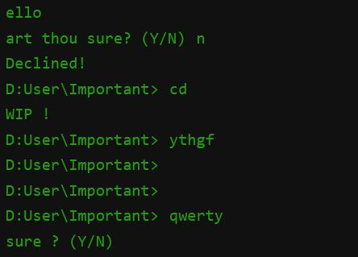

# terminal.lib

<p align="center">
  
</p>

 A Simple, Easy to use library that adds a terminal-like interface, with the abilty to execute commands like real terminals

## Installation

```html
<script src="lib/terminal.js"></script>
```


## Usage

- Creating a New Terminal Instance

```js
let target = document.querySelector(".container")

let terminal1 = new Termial({
	target: target, // The div containing the terminal will be a child of this parent
	backgroundColor: "blue", // Default is black (#111)
	color: "white", // Default is green (#279c10)
	fontSize: "1rem", // Default is 2.5rem (depends on the page default)
	fontFamily: "initial" // Default is monospace
});
```


- Printing Something in the Terminal

```js
terminal1.print("Hello there", 1200); 
// expected output: printing "Hello there" after 1.2 seconds
```


- Sending a Confermation Message 

```js
terminal1.confirm({
	text: "Are you sure about that?",
	time: 600,
	callbackY: () => terminal1.print("Accepted !", 500),
	callbackN: () => terminal1.print("Declined !", 500)
});
// expected output: printing "Are you sure about that? (Y/N)", when confirmed with Y/y, callbackY 
// will be executed. when declined with N/n, callbackN will be executed. otherwise, it will repeat
// the command until it is confirmed or declined
```


- waiting for user to input a command defined by author

```js
terminal1.prompt({
	prefix: "C:\User\downloads>  ",
	time: 700,
	commands: {
		print1: () => terminal1.print("print1 have been executed !",400),
		print2: () => terminal1.print("print2 have been executed !",400),
		console: () => {
			terminal1.print("check the console for some magic !",400)
			console.log("FooBar restaurant is amazing !")
		}
	},
	reUse: {
		mode: true,
		time: 500
	}
});

// expected output: printing "C:\\User\\downloads>  ", And whenever the user inputs any command, the 
// command callback will be executed, since "reUse" is enabled, it will re-use the same method with 
// the same properties after any of the commands is been executed with a timer of 500ms between 
// them. if the user inputs a command not listed, the prompt will be repeated
```

> note that in order to do a sequence of commands, you have to put them under each other's callbacks, otherwise, they will all be executed at once

## Authors
this simple project is entirely made by me, almajd3713, any suggestions or ideas are welcome. i am planning to update this project over time with bug fixes, new features, and maybe some refactoring or changing in its functionality to make it better.

## License

[MIT](https://choosealicense.com/licenses/mit/)